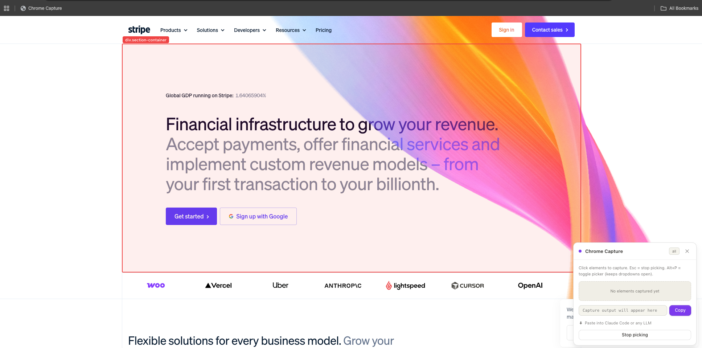
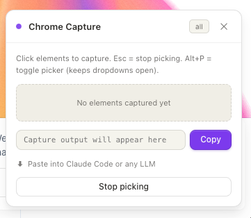
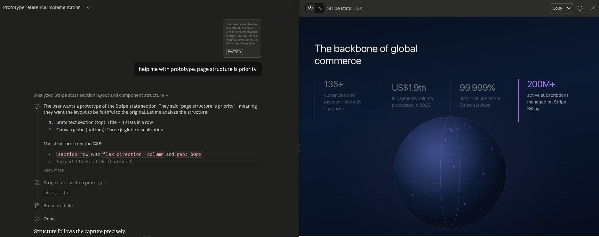
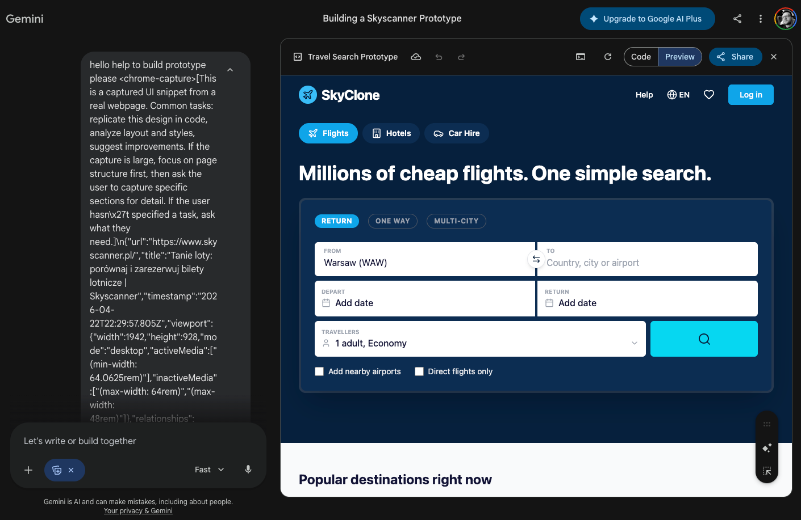

# Chrome Capture

Capture any UI element from any website as structured JSON. Paste into Claude, ChatGPT, Gemini, or any LLM to reproduce, analyze, or debug it.



## Install (30 seconds)

1. Open [`dist/bookmarklet.txt`](dist/bookmarklet.txt) and copy everything (starts with `javascript:`)
2. Right-click your bookmarks bar → **Add page...**
3. Name it anything, paste as the **URL** → Save

No build, no extension, no dependencies.

## How to use

1. **Click the bookmark** on any page — a panel appears in the corner



2. **Click any element** to capture it — hover to preview what you'll get


3. **Hit Copy**, paste into any LLM — ask it to reproduce the component



4. **Layout mode** — switch to `layout`, click a container to capture the spatial structure, then ask the LLM to build a prototype



### Tips

- **Esc** — stop picking
- **Alt+P** on Windows/Linux, **Option+P** on Mac — toggle picker without clicking, keeps dropdowns/modals open
- **X** — remove individual captures before copying
- **Smaller is better** — start with `layout` on the whole page, then capture individual components in `all` mode for detail

## Three capture modes

| Mode | What it captures | Use for |
|------|-----------------|---------|
| `all` | Full HTML, computed styles, CSS rules, pseudo-states, fonts, accessibility data | Reproducing a component exactly |
| `structure` | HTML skeleton without text nodes, complex SVGs replaced with placeholders | Understanding layout without content noise |
| `layout` | Spatial block tree — rectangles with names and positions, no HTML/CSS | Page-level prototyping, wireframes |

You can mix modes — capture a page header in `layout` and a button in `all`. Each mode emits its own `<chrome-capture>` tag.

## What gets captured

**Included:** clean HTML, computed styles (non-default only), CSS rules with media queries, pseudo-states (`:hover`, `:focus`, etc.), CSS variable tokens as a separate dictionary, viewport context with responsive breakpoints, XPath for element addressing, accessibility data (roles, names, ARIA states, form fields), developer hints (`data-testid`, `data-cy`, `data-qa`), pseudo-elements (`::before`/`::after`), loaded fonts, landmark context, element relationships (DOM + spatial), and detected frameworks.

**Stripped automatically:** scripts, iframes, ads, trackers (Google/Facebook/Segment/Hotjar/etc.), framework internals (React/Vue/Angular/Svelte/Astro), inline event handlers, HTML comments, base64 data URIs (replaced with placeholders preserving dimensions), the capture panel itself. Long `innerText` is truncated at 3000 characters.

**Detected frameworks:** Vue, React, Next.js, Nuxt, Angular, Svelte, jQuery, Tailwind, Bootstrap.

See [docs/capture-format.md](docs/capture-format.md) for the full output specification.

## Output structure

The output wraps JSON in `<chrome-capture>` tags that LLMs can reliably parse:

```
<chrome-capture frameworks="React,Tailwind">{envelope JSON}</chrome-capture>
```

For `all`/`structure` modes, the envelope contains page-level fields (`url`, `title`, `timestamp`, `viewport`) and an `elements[]` array. CSS rules are deduplicated into a shared `cssRules[]` pool — elements reference them by index via `cssRuleRefs`.

For `layout` mode, the envelope contains a `layouts[]` array with spatial block trees.

When multiple elements are captured, `relationships[]` describes how they relate (parent/child, siblings, spatial position).

## Limitations

- **CSP restrictions** — some sites (GitHub, Google) block bookmarklets
- **Closed Shadow DOM** — elements inside closed shadow roots are not accessible
- **Cross-origin stylesheets** — re-fetched via `fetch()` when CORS headers are present, silently skipped otherwise

## Development

```bash
npm run build
```

No external dependencies. Single file: `src/bookmarklet.js` (~880 lines).

## License

MIT
